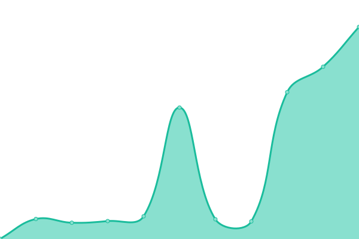
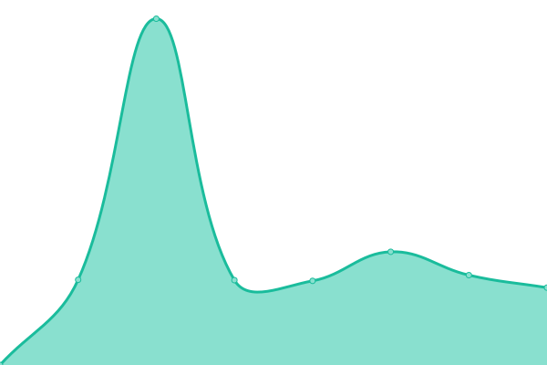
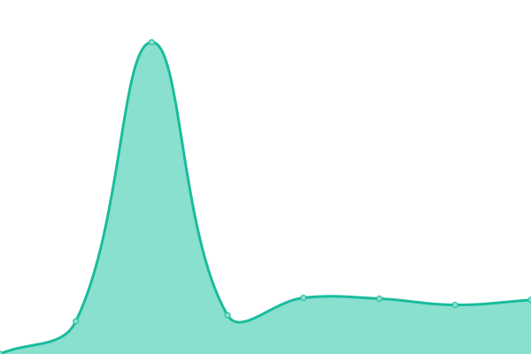

# [📈 Live Status](https://demo.upptime.js.org): <!--live status--> **🟩 All systems operational**

This repository contains the open-source uptime monitor and status page for [sammaryasir](https://demo.upptime.js.org), powered by [Upptime](https://github.com/upptime/upptime).

With [Upptime](https://upptime.js.org), you can get your own unlimited and free uptime monitor and status page, powered entirely by a GitHub repository. We use [Issues](https://github.com/sammaryasir/host/issues) as incident reports, [Actions](https://github.com/sammaryasir/host/actions) as uptime monitors, and [Pages](https://demo.upptime.js.org) for the status page.

<!--start: status pages-->
<!-- This summary is generated by Upptime (https://github.com/upptime/upptime) -->
<!-- Do not edit this manually, your changes will be overwritten -->
<!-- prettier-ignore -->
| URL | Status | History | Response Time | Uptime |
| --- | ------ | ------- | ------------- | ------ |
|  [HostNoc](https://www.hostnoc.com) | 🟩 Up | [host-noc.yml](https://github.com/sammaryasir/host/commits/HEAD/history/host-noc.yml) | 

 3295ms
     
 | 

<a href="https://demo.upptime.js.org/history/host-noc">99.42%</a>
    

|  [AntiDos](https://www.antidos.com) | 🟩 Up | [anti-dos.yml](https://github.com/sammaryasir/host/commits/HEAD/history/anti-dos.yml) | 

 2527ms
     
 | 

<a href="https://demo.upptime.js.org/history/anti-dos">100.00%</a>
    

|  [Branex](https://www.branex.com) | 🟩 Up | [branex.yml](https://github.com/sammaryasir/host/commits/HEAD/history/branex.yml) | 

 1059ms
     
 | 

<a href="https://demo.upptime.js.org/history/branex">100.00%</a>
    

|  [Branex UK](https://www.branex.co.uk) | 🟩 Up | [branex-uk.yml](https://github.com/sammaryasir/host/commits/HEAD/history/branex-uk.yml) | 

 193ms
     
 | 

<a href="https://demo.upptime.js.org/history/branex-uk">100.00%</a>
    

<!--end: status pages-->

[**Visit our status website →**](https://demo.upptime.js.org)

## 📄 License

- Powered by: [Upptime](https://github.com/upptime/upptime)
- Code: [MIT](./LICENSE) © [Anand Chowdhary](https://anandchowdhary.com), supported by [Pabio](https://pabio.com)
- Data in the `./history` directory: [Open Database License](https://opendatacommons.org/licenses/odbl/1-0/)
